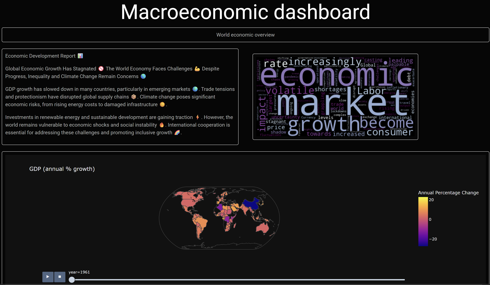
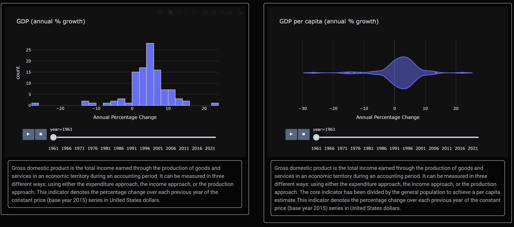
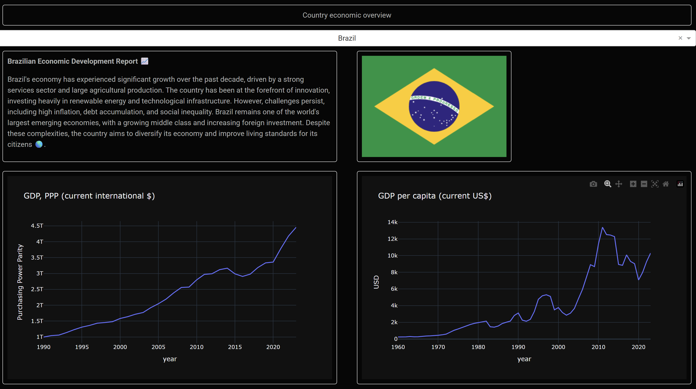

# Macroeconomics dashboard

`Macroeconomics dashboard` is a python-based web application that downloads, processes and visualizes main macroeconomics indicators. The data is downloaded from [World Bank](https://data.worldbank.org/) and [Organisation for Economic Co-operation and Development (OECD)](https://data-explorer.oecd.org/) via API. Downloaded data may be stored both in common `csv` files and in `PostgreSQL` database. Macroeconomics indicators are shown in the form of lineplots, histograms, maps, etc in the dashboard. Moreover, dashboard provides opportunity to use local `LLM` (via [Ollama](https://github.com/ollama/ollama)) for generating textual description of the current statement of global economy. Furthermore, plots may be saved in popular formats (`png`, `jpeg`, `pdf`, etc). 

## Illustrations

|  |  |  |
|-----------------------------|-----------------------------|-----------------------------|

## Technologies

- **Data Processing**: Pandas, NumPy
- **Database**: PostgreSQL, SQLAlchemy, psycopg2
- **Visualizations**: Plotly Dash
- **LLM**: Ollama

## Installation

(recommended to use python virtual environment for managing all the dependencies of the project, following installation procedure implies that virtual environment is activated)
1. Clone the repository:
   ```bash
   git clone https://github.com/alexveider1/Macroeconomics-Dashboard.git
   cd Macroeconomics-Dashboard
   ```
   
2. ```bash
   pip install -r requirements.txt
   ```

3. launch with default params:
    ```bash
    python app.py
    ```


## Configuration

Application has a lot of params for more flexible configuration. For setting param to its default value you do not need to add it to the launching command (just skip it)

* `--preload_data`: if you have launched the application before you can skip the step of downloading data by setting `--preload_data` to `true` (default `false`)
* `--use_postgres`: if you have PostgreSQL Server on your machine you may use it for storing data by setting `--use_postgres` to `true` (default `false` $-$ use csv-files for storing data)
* `--postgres_username`: PostgreSQL username required if `--use_postgres` set to `true` (default `none`)
* `--postgres_password`: PostgreSQL password required if `--use_postgres` set to `true` (default `none`)
* `--postgres_port`: PostgreSQL port required if `--use_postgres` set to `true` (default `none`)
* `--use_ollama`: if you have ollama installed on your machine you may use llm for textual description of the economics by setting `--use_ollama` to `true` (default `false`)
* `--ollama_model`: ollama llm model name (for example, `llama3.2:1b` or `deepseek-r1:7b` $-$ it is recommended to use small models for application acceleration) required if `--use_ollama` set to `true`, for example, (default `none`)
* `--web_ui_port`: port to use when launching web dashboard (default `0088`)

For example, 
```bash 
python app.py --use_postgres true --postgres_username your_username --postgres_password your_password --postgres_port 5432 --use_ollama true --ollama_model llama3.2:1b
```
